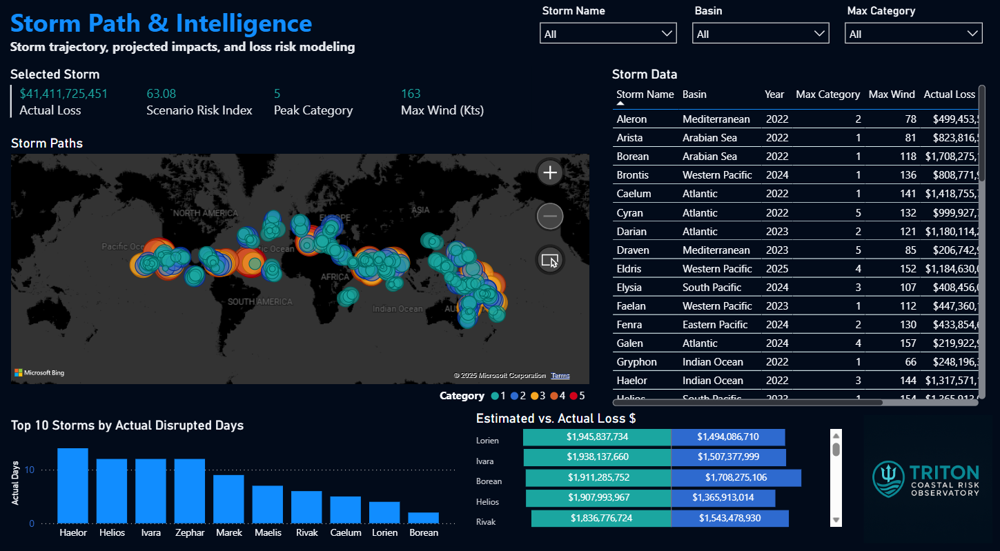
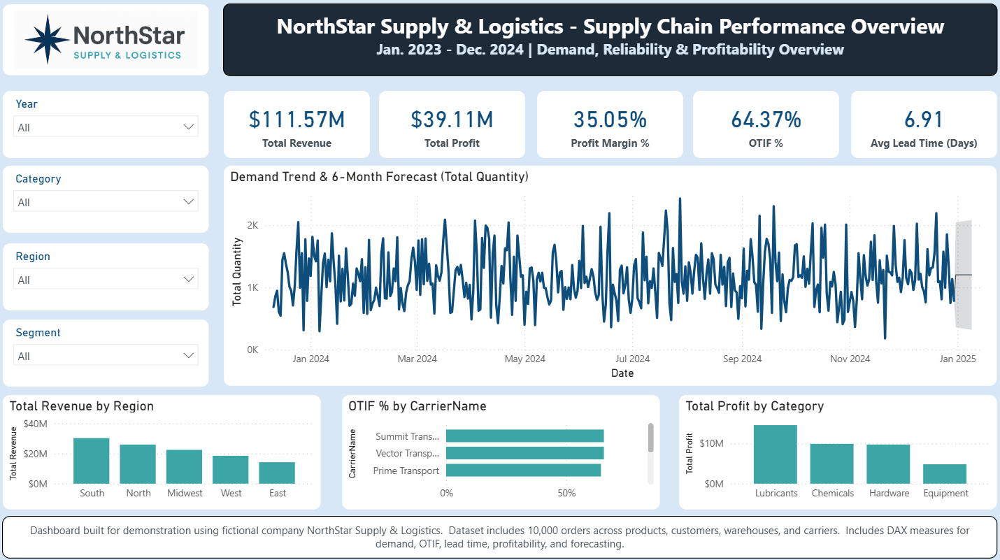
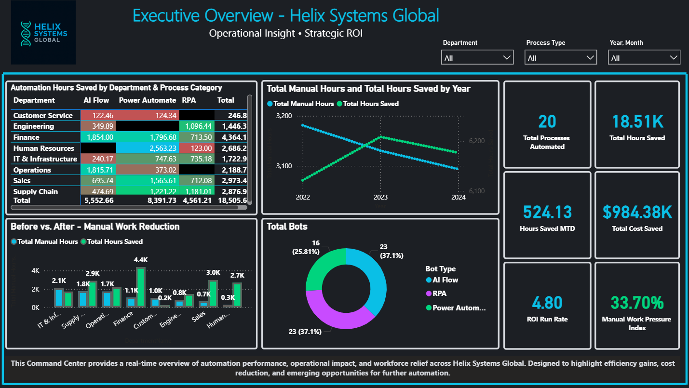
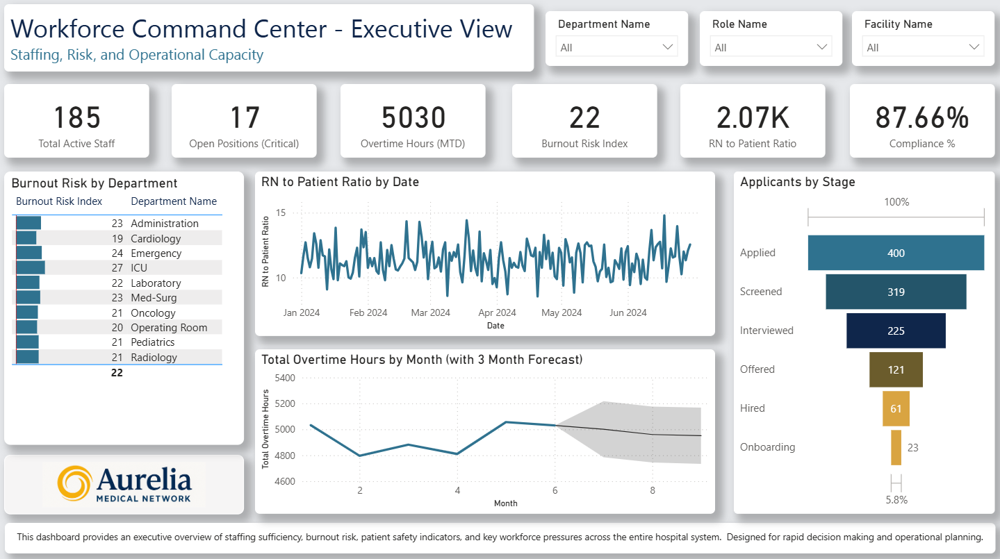
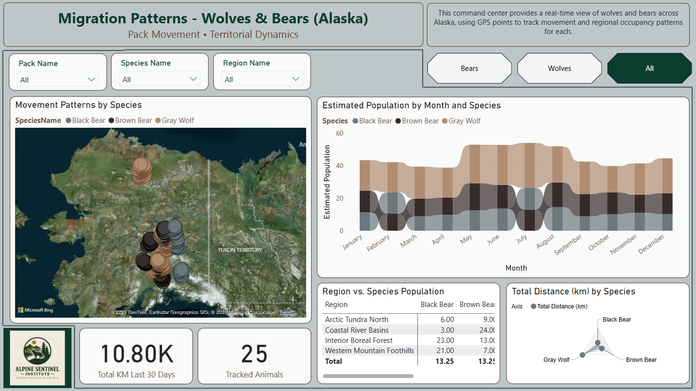

# Advanced Business Intelligence Portfolio - Sam Crissey
### Microsoft Power BI | Multimodal Analytics

---

## 👋 Welcome
This portfolio showcases analytical systems designed to solve real operational problems for fictional companies, reflecting business-level thinking, not just chart building — connecting decisions, operations, and risk.

Each report goes far beyond “typical dashboards” using mock data — these simulate real-world systems used by:
- Analysts & Enterprise BI Teams  
- Healthcare Workforce Directors  
- Environmental and Safety Risk Analysts 
- Automation & Efficiency Engineers  
- Logistics & Supply Chain Strategists  

---

## ❓ What This Portfolio Demonstrates
- Predictive analytics & forecasting
- Risk quantification & exposure modeling
- Geospatial analysis (lat/long mapping)
- Multi-table dimensional modeling
- Real-time KPI intelligence systems
- Workforce & healthcare resilience modeling
- Multi-industry BI maturity

---

## 1) 🌊 Triton Coastal Risk Observatory  
### **Global Ocean Storms & Economic Risk Intelligence System**

Identify and quantify coastal storm risk, economic exposure, and port vulnerability.

🔗 **Live Version:** https://app.fabric.microsoft.com/view?r=eyJrIjoiMDlhNzRjZmQtYTNiNC00ZjgwLTgwOWUtODU2NDFjYmQzNjJlIiwidCI6IjI0MzY1MTJlLWExMDctNGRjMi1hYWJlLTgxMzA4YjgzN2M3MCJ9

---

## 2) 🚚 NorthStar Supply & Logistics  
### **Global Supply Chain Performance Overview**

Provide visibility into supply reliability, lead times, OTIF, and profitability.

🔗 **Live Version:** https://app.fabric.microsoft.com/view?r=eyJrIjoiNGMxMjc4OTUtMTYwYi00ZWRlLTkxNzEtNGFlZTI4NzQxYzNmIiwidCI6IjI0MzY1MTJlLWExMDctNGRjMi1hYWJlLTgxMzA4YjgzN2M3MCJ9

---

## 3) 🤖 Helix Systems Global  
### **Automation ROI & Manual Work Reduction Dashboard**

Quantify automation impact, reduce manual work, and guide prioritization.

🔗 **Live Version:** https://app.fabric.microsoft.com/view?r=eyJrIjoiNDA5MmIxZGUtOGIxYi00M2E3LTlmN2QtMmI3YWU3MWFjNGEwIiwidCI6IjI0MzY1MTJlLWExMDctNGRjMi1hYWJlLTgxMzA4YjgzN2M3MCJ9

---

## 4) 🏥 Aurelia Medical Network  
### **Hospital Workforce Intelligence System**

Support staffing decisions, burnout mitigation, and patient safety readiness.

🔗 **Live Version:** https://app.fabric.microsoft.com/view?r=eyJrIjoiN2U0NDk4MTYtM2JkNC00ZDUzLTg1MDMtNTJmNTg0ZWZjNWZhIiwidCI6IjI0MzY1MTJlLWExMDctNGRjMi1hYWJlLTgxMzA4YjgzN2M3MCJ9

---

## 5) 🐺 Alpine Sentinel Institute  
### **Wolf & Bear Migration: Wildlife Risk Intelligence**

Track animal movement, identify seasonal patterns, and highlight interaction risk.

🔗 **Live Version:** https://app.fabric.microsoft.com/view?r=eyJrIjoiNDQxM2E1YzUtNzRjZC00MmYxLTgzYjgtMGE0ODdmZjY0MGRkIiwidCI6IjI0MzY1MTJlLWExMDctNGRjMi1hYWJlLTgxMzA4YjgzN2M3MCJ9

---

## 📈 These solutions include:

- Power BI data modeling with star schemas  
- DAX modeling for metrics, scoring, and forecasting  
- Automated calculations and comparisons  
- Multi-page dashboard architecture  
- Internal consistency checks and validation  
- Clean, standardized analytic structure  

---

## 🤝 Consulting & Collaboration

I help teams turn messy data into clean, easy-to-use dashboards.

If your organization struggles with:
- Reports that take too long to build  
- Decisions being made from spreadsheets  
- Manually copying/pasting numbers every week  
- Not having clear insight into performance  
- No unified "single source of truth"

I can help by building dashboards that:
- Show key metrics in one place  
- Update automatically from your data sources  
- Reduce manual work and reporting time  
- Help decision makers understand opportunities and risks  

---

## 🔍 Project Types
- Power BI dashboards built from scratch  
- Improving and cleaning existing reports  
- Connecting data from Excel, SharePoint, SAP, SQL  
- Automating manual reporting processes  
- "One-off" dashboards for specific needs

---

## 📬 Contact
If you want to discuss a project or dashboard idea, feel free to reach out through email, GitHub or LinkedIn.

-**Email:** sr.crisse@gmail.com  
-**LinkedIn:** www.linkedin.com/in/sam-crissey-064777241  
